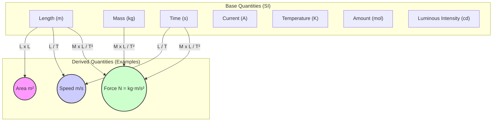

### 1.1 Importance of Measurement

Why do we need to measure things in physics? Measurement forms the bedrock of physics, allowing us to quantify the world around us and understand its underlying principles. This section explores why measurement is crucial and introduces the fundamental types of physical quantities.
Physics is an experimental science. To understand the laws of nature, we need to observe and measure physical quantities accurately. Measurement provides the quantitative data necessary to:

*   **Test Hypotheses and Theories:** Experiments are designed to test predictions made by physical theories. Accurate measurements are crucial to determine if experimental results support or contradict a theory.
*   **Establish Relationships:** Measurements allow us to find mathematical relationships between different physical quantities (e.g., how the force on an object relates to its acceleration).
*   **Ensure Reproducibility:** Scientific findings must be reproducible. Precise measurements using standardized units allow scientists worldwide to replicate experiments and verify results.
*   **Enable Technology:** Engineering and technology rely heavily on precise measurements for designing and manufacturing everything from microchips to bridges.

**Physical Quantities:**

A **physical quantity** is any property of a material or system that can be quantified by measurement. Examples include length, mass, time, temperature, force, and velocity.

Physical quantities can be classified into two types:

1.  **Base Quantities (or Fundamental Quantities):** These are a small set of quantities that are considered fundamental and are defined independently. In the International System of Units (SI), there are seven base quantities:
    *   Length
    *   Mass
    *   Time
    *   Electric Current
    *   Thermodynamic Temperature
    *   Amount of Substance
    *   Luminous Intensity
2.  **Derived Quantities:** These are quantities whose definitions are based on combinations of base quantities. Their units are derived from the base units. Examples include:
    *   Area (Length × Length)
    *   Volume (Length × Length × Length)
    *   Speed (Length / Time)
    *   Acceleration (Length / Time²)
    *   Force (Mass × Acceleration = Mass × Length / Time²)
    *   Energy (Force × Distance = Mass × Length² / Time²)

The relationship between base and derived quantities can be visualized as follows:

Understanding this distinction is essential for working with units and performing dimensional analysis (covered in the next section).

#### Real-World Connections

*   **Cooking:** Recipes require precise measurements of ingredients (mass, volume).
*   **Construction:** Building structures requires accurate measurements of length, angles, and forces.
*   **Sports:** Performance analysis often involves measuring speed, distance, time, and forces.
*   **Navigation:** GPS systems rely on precise time and distance measurements to determine location.

#### Practice Problems

1. **Basic Level:** Classify each of the following as either a base quantity or a derived quantity: (a) volume, (b) mass, (c) velocity, (d) time, (e) electric current, (f) pressure.
   *Solution: Base quantities: (b) mass, (d) time, (e) electric current. Derived quantities: (a) volume [L³], (c) velocity [L/T], (f) pressure [M/(L·T²)].*

2. **Intermediate Level:** A new physical quantity X is defined as the product of force and time. Determine the SI unit of X and express it in terms of base units.
   *Hint: Start by writing force in terms of mass, length, and time.*
   *Solution: X = Force × Time = (kg·m/s²) × s = kg·m/s. In terms of base units, [X] = [M][L][T]⁻¹.*

3. **Advanced Level:** The period (T) of a simple pendulum depends on its length (L) and the acceleration due to gravity (g). Using dimensional analysis, determine the relationship between T, L, and g.
   *Hint: Assume T ∝ L^a × g^b and analyze the dimensions.*
   *Solution: [T] = [T], [L] = [L], [g] = [L][T]⁻². If T ∝ L^a × g^b, then [T] = [L]^a × [L]^b[T]^(-2b) = [L]^(a+b)[T]^(-2b). Equating dimensions: For [T]: 1 = -2b, so b = -1/2. For [L]: 0 = a+b, so a = -b = 1/2. Therefore, T ∝ L^(1/2) × g^(-1/2) = √(L/g).*

#### Key Takeaways

*   Physics relies on accurate measurement to test theories, establish relationships, ensure reproducibility, and enable technology.
*   Physical quantities are measurable properties, classified as either base (fundamental) or derived (combinations of base quantities).
*   The seven SI base quantities are length, mass, time, electric current, thermodynamic temperature, amount of substance, and luminous intensity.

#### Common Misconceptions

*   **Misconception:** All physical quantities are directly measurable.
   **Correction:** While many quantities can be measured directly (like length or mass), others are measured indirectly through their effects or relationships with other quantities (like electric field or entropy).

*   **Misconception:** The choice of base quantities is based on fundamental physical principles.
   **Correction:** The choice of base quantities is somewhat arbitrary and based on practical considerations. Different systems of units can choose different quantities as their base units.

#### Try It Yourself

**Measurement Precision Activity: How Good Are Your Estimates?**

**Materials needed:**
- A ruler or measuring tape
- 5-10 common objects of different sizes (e.g., book, phone, pencil)
- Paper and pencil for recording

**Procedure:**
1. Select several objects of different sizes.
2. For each object, first estimate its length without using any measuring tool.
3. Record your estimate.
4. Now measure the object using the ruler or measuring tape.
5. Calculate the percentage error: |Estimated value - Measured value| / Measured value × 100%

**Questions to Consider:**
- Which sizes were you better at estimating? Very small, medium, or large objects?
- Did your estimation accuracy improve with practice?
- How would your ability to make these estimates affect a scientific experiment?
- Why is it important to use standardized measuring tools rather than estimation in science?

#### Historical Note

The development of standardized measurements has a rich history spanning thousands of years. Ancient civilizations like the Egyptians, Babylonians, and Romans developed their own measurement systems, often based on human body parts (e.g., the cubit, based on the forearm length). The metric system emerged during the French Revolution (1790s) as an attempt to rationalize measurements. The modern SI system was formally established in 1960 at the 11th General Conference on Weights and Measures, though it has roots in the meter-kilogram-second (MKS) system developed in the 19th century. The definitions of base units have evolved over time, becoming increasingly precise and based on fundamental physical constants rather than physical artifacts.