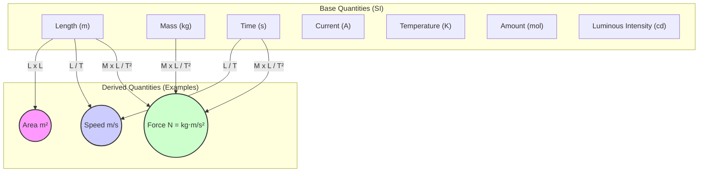

### 1.1 Importance of Measurement

Why do we need to measure things in physics? Measurement forms the bedrock of physics, allowing us to quantify the world around us and understand its underlying principles. This section explores why measurement is crucial and introduces the fundamental types of physical quantities.
Physics is an experimental science. To understand the laws of nature, we need to observe and measure physical quantities accurately. Measurement provides the quantitative data necessary to:

*   **Test Hypotheses and Theories:** Experiments are designed to test predictions made by physical theories. Accurate measurements are crucial to determine if experimental results support or contradict a theory.
*   **Establish Relationships:** Measurements allow us to find mathematical relationships between different physical quantities (e.g., how the force on an object relates to its acceleration).
*   **Ensure Reproducibility:** Scientific findings must be reproducible. Precise measurements using standardized units allow scientists worldwide to replicate experiments and verify results.
*   **Enable Technology:** Engineering and technology rely heavily on precise measurements for designing and manufacturing everything from microchips to bridges.

**Physical Quantities:**

A **physical quantity** is any property of a material or system that can be quantified by measurement. Examples include length, mass, time, temperature, force, and velocity.

Physical quantities can be classified into two types:

1.  **Base Quantities (or Fundamental Quantities):** These are a small set of quantities that are considered fundamental and are defined independently. In the International System of Units (SI), there are seven base quantities:
    *   Length
    *   Mass
    *   Time
    *   Electric Current
    *   Thermodynamic Temperature
    *   Amount of Substance
    *   Luminous Intensity
2.  **Derived Quantities:** These are quantities whose definitions are based on combinations of base quantities. Their units are derived from the base units. Examples include:
    *   Area (Length × Length)
    *   Volume (Length × Length × Length)
    *   Speed (Length / Time)
    *   Acceleration (Length / Time²)
    *   Force (Mass × Acceleration = Mass × Length / Time²)
    *   Energy (Force × Distance = Mass × Length² / Time²)

The relationship between base and derived quantities can be visualized as follows:

Understanding this distinction is essential for working with units and performing dimensional analysis (covered in the next section).

#### Real-World Connections

*   **Cooking:** Recipes require precise measurements of ingredients (mass, volume).
*   **Construction:** Building structures requires accurate measurements of length, angles, and forces.
*   **Sports:** Performance analysis often involves measuring speed, distance, time, and forces.
*   **Navigation:** GPS systems rely on precise time and distance measurements to determine location.

#### Practice Problems

*(Placeholder: Add 2-3 practice problems related to identifying base/derived quantities or the importance of measurement.)*

#### Key Takeaways

*   Physics relies on accurate measurement to test theories, establish relationships, ensure reproducibility, and enable technology.
*   Physical quantities are measurable properties, classified as either base (fundamental) or derived (combinations of base quantities).
*   The seven SI base quantities are length, mass, time, electric current, thermodynamic temperature, amount of substance, and luminous intensity.