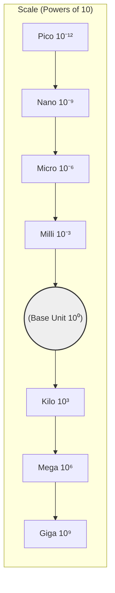
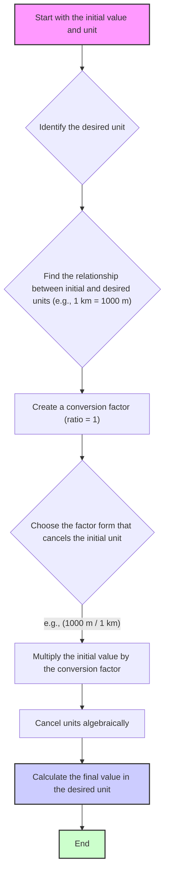

### 1.2 SI Units
To ensure consistency and allow scientists worldwide to compare results, a standardized system of units is essential. The **International System of Units (SI)** (from the French *Système International d'Unités*) is the modern form of the metric system and the most widely used system of measurement in science and technology.

**SI Base Units:**

The SI system is built upon seven **base units**, each corresponding to one of the base quantities identified in section 1.1:

| Base Quantity             | SI Base Unit | Symbol |
| :------------------------ | :----------- | :----- |
| Length                    | meter        | m      |
| Mass                      | kilogram     | kg     |
| Time                      | second       | s      |
| Electric Current          | ampere       | A      |
| Thermodynamic Temperature | kelvin       | K      |
| Amount of Substance       | mole         | mol    |
| Luminous Intensity        | candela      | cd     |

*Note: While the kilogram is the base unit, prefixes (see below) are often applied to the gram (1 g = 0.001 kg) for convenience.*

**SI Derived Units:**

Units for derived quantities are formed by combining the base units according to the algebraic relationship defining the quantity. Many derived units have special names and symbols.

| Derived Quantity | Relationship with Base Quantities | SI Derived Unit | Symbol | Equivalent Base Units |
| :--------------- | :-------------------------------- | :-------------- | :----- | :-------------------- |
| Area             | Length × Length                   | square meter    | m²     | m²                    |
| Volume           | Length × Length × Length          | cubic meter     | m³     | m³                    |
| Speed, Velocity  | Length / Time                     | meter per second| m/s    | m s⁻¹                 |
| Acceleration     | Length / Time²                    | meter per second squared | m/s² | m s⁻² |
| Force            | Mass × Acceleration               | newton          | N      | kg m s⁻²              |
| Energy, Work     | Force × Length                    | joule           | J      | N m = kg m² s⁻²       |
| Power            | Energy / Time                     | watt            | W      | J/s = kg m² s⁻³       |
| Pressure         | Force / Area                      | pascal          | Pa     | N/m² = kg m⁻¹ s⁻²     |
| Frequency        | 1 / Time                          | hertz           | Hz     | s⁻¹                   |
| Electric Charge  | Current × Time                    | coulomb         | C      | A s                   |
| Voltage          | Energy / Charge                   | volt            | V      | J/C = kg m² s⁻³ A⁻¹   |
| Resistance       | Voltage / Current                 | ohm             | Ω      | V/A = kg m² s⁻³ A⁻²   |

**SI Prefixes:**

To handle very large or very small quantities conveniently, the SI system uses prefixes to denote multiples or submultiples of powers of 10.

| Prefix | Symbol | Factor     | Example         |
| :----- | :----- | :--------- | :-------------- |
| giga   | G      | 10⁹        | 1 GWh (gigawatt-hour) |
| mega   | M      | 10⁶        | 2 MJ (megajoules) |
| kilo   | k      | 10³        | 5 km (kilometers) |
| centi  | c      | 10⁻²       | 30 cm (centimeters) |
| milli  | m      | 10⁻³       | 100 mg (milligrams) |
| micro  | µ      | 10⁻⁶       | 50 µs (microseconds) |
| nano   | n      | 10⁻⁹       | 600 nm (nanometers) |
| pico   | p      | 10⁻¹²      | 10 pF (picofarads) |

Here's a visual representation of some common prefixes on a logarithmic scale:



**Unit Conversions:**

Converting between units is often necessary. This usually involves multiplying by a **conversion factor**, which is a ratio equal to 1.

*Example:* Convert 5 kilometers (km) to meters (m).
We know 1 km = 1000 m. The conversion factor can be written as (1000 m / 1 km) or (1 km / 1000 m). We choose the one that cancels the original unit:
`5 km × (1000 m / 1 km) = 5000 m`

*Example:* Convert 60 miles per hour (mph) to meters per second (m/s).
(Given: 1 mile ≈ 1609 m, 1 hour = 3600 s)
`60 miles/hour × (1609 m / 1 mile) × (1 hour / 3600 s) ≈ 26.8 m/s`

*Example:* Convert 2500 cm³ to m³.
We know 1 m = 100 cm, so 1 m³ = (100 cm)³ = 1,000,000 cm³.
`2500 cm³ × (1 m³ / 1,000,000 cm³) = 0.0025 m³`

The general process for unit conversion using conversion factors:



**Dimensional Analysis:**

Dimensional analysis is a powerful technique used to check the consistency of equations and derive relationships between physical quantities. It involves treating the dimensions (like Length [L], Mass [M], Time [T]) of quantities as algebraic variables.

*   **Checking Equations:** Both sides of a valid physical equation must have the same dimensions.
    *Example:* Check the equation `distance = speed × time`.
    Dimensions: `[L] = [L/T] × [T] = [L]`. The equation is dimensionally consistent.

    Visualizing the check:
    ```mermaid
    graph TD
        subgraph "Equation"
            Eq["distance = speed × time"]
        end
        subgraph "Dimensions"
            DimL["[L]"]
            DimR["[L/T] × [T]"]
        end
        Eq --> DimL & DimR
        DimR --> DimR_Simplified["[L]"]
        DimL --> Check{"Compare Dimensions"};
        DimR_Simplified --> Check;
        Check -- "Dimensions Match" --> Result["Consistent"];

        style Result fill:#cfc,stroke:#333,stroke-width:2px
    ```

    *Example:* Check `v = at` (velocity = acceleration × time).
    Dimensions: `[L/T] = [L/T²] × [T] = [L/T]`. Consistent.
*   **Deriving Relationships:** Dimensional analysis can sometimes help deduce the form of an equation (up to a dimensionless constant).
    *Example:* How does the period (T) of a simple pendulum depend on its length (L) and the acceleration due to gravity (g)?
    Assume `T ∝ Lᵃ gᵇ`. Dimensions: `[T] ∝ [L]ᵃ [L/T²]ᵇ = [L]ᵃ⁺ᵇ [T]⁻²ᵇ`.
    Matching dimensions:
    For [T]: `1 = -2b` => `b = -1/2`
    For [L]: `0 = a + b` => `a = -b = 1/2`
    So, `T ∝ L¹ᐟ² g⁻¹ᐟ² = √(L/g)`. (The constant factor, 2π, cannot be found by dimensional analysis alone).

    *Example:* Check the formula for kinetic energy `KE = 1/2 mv²`.
    Dimensions of KE (Energy = Force × Distance): `[M L²/T²]`
    Dimensions of `1/2 mv²`: `[M] × [L/T]² = [M L²/T²]` (Note: numerical factors like 1/2 are dimensionless).
    The dimensions match, so the formula is dimensionally consistent.

Dimensional analysis is a crucial tool for verifying calculations and understanding the relationships between physical quantities.

#### Real-World Connections

*   **International Trade & Science:** SI units provide a universal language for measurements, facilitating global collaboration and commerce.
*   **Engineering Blueprints:** Standardized units (like millimeters or meters) are essential for accurate design and manufacturing.
*   **Medicine:** Dosages are measured in milligrams (mg) or milliliters (mL), requiring careful use of prefixes.
*   **Computing:** Data storage uses prefixes like kilo, mega, giga, tera (though sometimes based on powers of 2, especially for RAM).

#### Practice Problems

1. **Basic Level:** Convert the following quantities to the indicated units:
   a) 3.5 km to meters
   b) 250 mg to grams
   c) 7200 seconds to hours
   d) 0.35 m/s to km/h
   
   *Solutions:*
   a) 3.5 km × (1000 m / 1 km) = 3500 m
   b) 250 mg × (1 g / 1000 mg) = 0.25 g
   c) 7200 s × (1 h / 3600 s) = 2 h
   d) 0.35 m/s × (3600 s / 1 h) × (1 km / 1000 m) = 1.26 km/h

2. **Intermediate Level:** A car travels at 65 mph for 2.5 hours. Calculate the distance traveled in kilometers.
   
   *Hint: First convert mph to km/h, then calculate the distance.*
   
   *Solution:*
   Step 1: Convert 65 mph to km/h
   65 miles/h × (1.609 km / 1 mile) = 104.585 km/h
   
   Step 2: Calculate distance
   Distance = speed × time = 104.585 km/h × 2.5 h = 261.46 km

3. **Advanced Level:** The energy E of a photon is related to its frequency f by the equation E = hf, where h is Planck's constant (6.63 × 10⁻³⁴ J·s). Using dimensional analysis, determine the dimensions of Planck's constant.
   
   *Solution:*
   We know E has dimensions of energy: [M][L]²[T]⁻²
   Frequency f has dimensions of [T]⁻¹
   
   From E = hf, we can write:
   [M][L]²[T]⁻² = [h] × [T]⁻¹
   
   Solving for [h]:
   [h] = [M][L]²[T]⁻² ÷ [T]⁻¹ = [M][L]²[T]⁻¹
   
   Therefore, Planck's constant has dimensions of [M][L]²[T]⁻¹, which is consistent with its units of joule-seconds (J·s).

4. **Intermediate Level:** A rectangular swimming pool is 25 m long, 10 m wide, and 2 m deep. Calculate its volume in (a) cubic meters and (b) liters.
   
   *Solution:*
   a) Volume = length × width × depth = 25 m × 10 m × 2 m = 500 m³
   b) 1 m³ = 1000 L, so 500 m³ × (1000 L / 1 m³) = 500,000 L

#### Key Takeaways

*   The SI system provides a standardized set of base units (m, kg, s, A, K, mol, cd) for fundamental quantities.
*   Derived units are combinations of base units (e.g., N = kg m/s²).
*   Prefixes denote powers of 10 for scaling units (e.g., kilo = 10³, milli = 10⁻³).
*   Unit conversions use conversion factors (ratios equal to 1) to change units without changing the value.
*   Dimensional analysis uses the dimensions [L], [M], [T], etc., to check equation consistency and derive relationships.

#### Common Misconceptions

*   **Misconception:** The kilogram is a base unit because it's more commonly used than the gram.
   **Correction:** The kilogram is the SI base unit for mass for historical reasons, not because of frequency of use. It was originally defined as the mass of 1 liter of water at 4°C, and this definition was retained when the SI system was formalized.

*   **Misconception:** Prefixes like "kilo" and "milli" can be applied to any unit.
   **Correction:** While prefixes can be applied to most SI units, there are exceptions. For example, the base unit for mass already includes a prefix (kilogram), so prefixes are applied to the gram instead (e.g., milligram, not millikilogram).

*   **Misconception:** Unit conversions always involve multiplication.
   **Correction:** Unit conversions involve multiplication by a conversion factor, but the conversion factor itself may represent division. The key is to set up the conversion factor so that the original units cancel out algebraically.

*   **Misconception:** Dimensional analysis can completely determine the form of an equation.
   **Correction:** Dimensional analysis can determine the form of an equation only up to a dimensionless constant. For example, it can tell us that the period of a pendulum is proportional to √(L/g), but not that the constant of proportionality is 2π.

#### Try It Yourself

**Creating Your Own Unit Conversion Chain**

**Materials needed:**
- Paper and pencil
- Calculator (optional)

**Procedure:**
1. Choose a starting quantity (e.g., your height in feet and inches)
2. Convert this quantity through at least 4 different units, creating a "chain" of conversions
3. For each step, write down the conversion factor you're using
4. Calculate the final result
5. As a check, try to convert directly from your starting unit to your final unit

**Example Chain:**
- Height: 5 feet 10 inches
- Convert to inches: 5 ft × (12 in/ft) + 10 in = 70 inches
- Convert to centimeters: 70 in × (2.54 cm/in) = 177.8 cm
- Convert to meters: 177.8 cm × (1 m/100 cm) = 1.778 m
- Convert to kilometers: 1.778 m × (1 km/1000 m) = 0.001778 km

**Questions to Consider:**
- Did you get the same answer when converting directly?
- What happens to the precision of your measurement as you go through multiple conversions?
- How could errors propagate through a chain of conversions?
- Why is it important for scientists worldwide to use the same system of units?

#### Historical Note

The development of the metric system, which later evolved into the SI system, began during the French Revolution in the late 18th century. Before this, measurements varied widely not only between countries but even between neighboring towns, causing significant problems for trade and scientific communication.

In 1791, the French Academy of Sciences defined the meter as one ten-millionth of the distance from the North Pole to the Equator along a meridian passing through Paris. The kilogram was defined as the mass of one cubic decimeter (liter) of water at 4°C. These definitions were practical attempts to base units on natural constants.

The modern International System of Units (SI) was established in 1960 by the 11th General Conference on Weights and Measures (CGPM). Over time, the definitions of the base units have evolved to be based on fundamental physical constants rather than physical artifacts. For example, the meter was redefined in 1983 in terms of the speed of light, and in 2019, the kilogram was redefined in terms of the Planck constant, completing the transition of all SI base units to definitions based on physical constants.

This evolution reflects a fundamental goal of metrology: to define units in ways that are invariant, accessible to all, and of the highest possible precision.