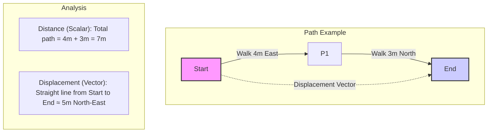
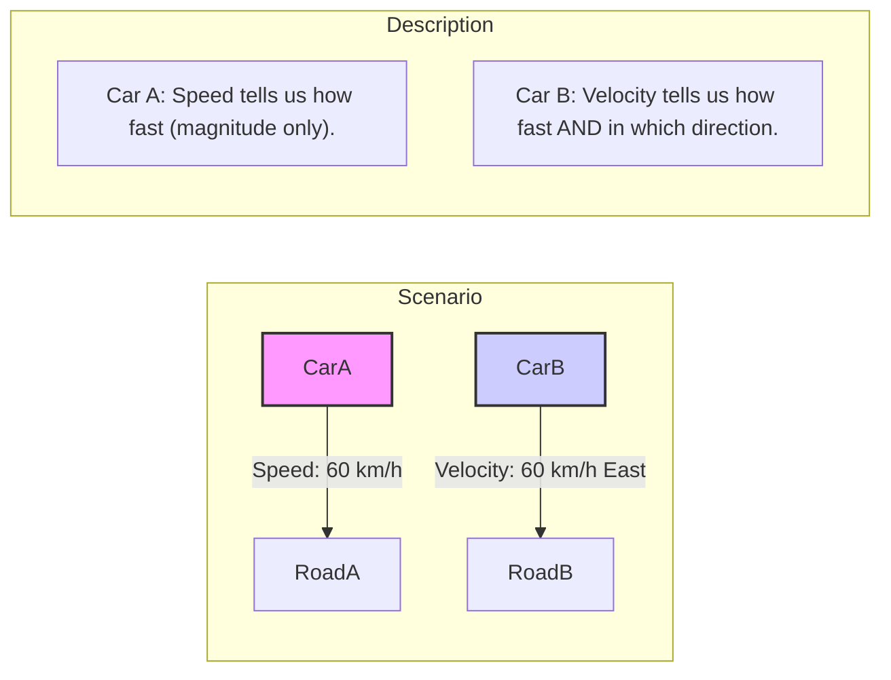

### 1.3 Scalars and Vectors
When describing physical quantities, we often need to specify more than just a number and a unit. Some quantities also require a direction. This leads to the classification of physical quantities into scalars and vectors.

**Scalars:**

A **scalar quantity** is a physical quantity that is fully described by its **magnitude** (a numerical value) and its **unit**. It has no direction associated with it.

*   **Examples of Scalars:**
    *   **Distance:** The total path length covered (e.g., 5 km).
    *   **Speed:** How fast an object is moving (e.g., 60 km/h).
    *   **Mass:** The amount of matter in an object (e.g., 2 kg).
    *   **Time:** Duration (e.g., 30 s).
    *   **Temperature:** Degree of hotness or coldness (e.g., 25 °C or 298 K).
    *   **Energy:** Capacity to do work (e.g., 100 J).
    *   **Work:** Energy transferred by a force (e.g., 50 J).
    *   **Power:** Rate of energy transfer (e.g., 60 W).
    *   **Density:** Mass per unit volume (e.g., 1000 kg/m³).
    *   **Volume:** Space occupied (e.g., 2 m³).
    *   **Electric Charge:** (e.g., 1.6 x 10⁻¹⁹ C).

Scalar quantities can be added, subtracted, multiplied, and divided using ordinary arithmetic rules (provided they have the same units when adding or subtracting).

Consider the difference between **distance** (scalar) and **displacement** (vector):

**Vectors:**

A **vector quantity** is a physical quantity that requires both **magnitude** (with unit) and **direction** to be fully described.

*   **Examples of Vectors:**
    *   **Displacement:** The change in position from a starting point to an ending point, including direction (e.g., 5 km North).
    *   **Velocity:** The rate of change of displacement (speed *and* direction) (e.g., 60 km/h East).
    *   **Acceleration:** The rate of change of velocity (e.g., 9.8 m/s² downwards).
    *   **Force:** A push or a pull (e.g., 10 N upwards).
    *   **Momentum:** Mass times velocity (e.g., 50 kg m/s West).
    *   **Weight:** The force of gravity acting on an object (e.g., 98 N downwards).
    *   **Electric Field:** Force per unit charge (e.g., 200 N/C to the right).
    *   **Magnetic Field:** (e.g., 0.5 T into the page).

Similarly, consider **speed** (scalar) vs. **velocity** (vector):

Vectors are typically represented graphically by arrows. The length of the arrow represents the magnitude (to scale), and the direction the arrow points indicates the direction of the vector.

*(Placeholder for Image: Create an image file (e.g., `01-3_vector_representation.png`) and save it in the `01-Measurements-and-Units/assets/` folder. The image should show an arrow originating from a coordinate system. Label the arrow's length as 'Magnitude (e.g., 5 m)' and indicate its 'Direction' with an angle relative to an axis (e.g., 30° North of East). Add the image here using ``)*

Adding, subtracting, and multiplying vectors requires special methods (vector algebra), which will be covered in more detail in Chapter 2 (Mechanics). This section serves as an introduction to the concept and distinction.

#### Real-World Connections

*   **Navigation:** Giving directions involves vectors (e.g., "walk 500m North, then 200m East"). Displacement is key.
*   **Weather Forecasts:** Wind speed and direction are reported as vectors.
*   **Aviation:** Pilots must account for wind velocity (a vector) when planning flights.
*   **Sports:** Analyzing the trajectory of a ball requires considering its initial velocity (a vector) and the forces (vectors) acting on it.

#### Practice Problems

1. **Basic Level:** Classify each of the following quantities as either a scalar or a vector:
   a) The mass of a car
   b) The velocity of a rocket
   c) The temperature of a room
   d) The force applied to a door
   e) The volume of water in a tank
   f) The acceleration of a falling object
   
   *Solution:*
   a) Scalar - mass has magnitude only
   b) Vector - velocity has both magnitude and direction
   c) Scalar - temperature has magnitude only
   d) Vector - force has both magnitude and direction
   e) Scalar - volume has magnitude only
   f) Vector - acceleration has both magnitude and direction

2. **Intermediate Level:** A hiker walks 3 km east, then 4 km north, and finally 2 km east. Calculate:
   a) The total distance traveled
   b) The displacement (magnitude and direction) from the starting point
   
   *Solution:*
   a) Total distance = 3 km + 4 km + 2 km = 9 km
   
   b) Displacement:
   - Total eastward component = 3 km + 2 km = 5 km
   - Total northward component = 4 km
   - Magnitude of displacement = √(5² + 4²) = √(25 + 16) = √41 ≈ 6.4 km
   - Direction: θ = tan⁻¹(4/5) ≈ 38.7° north of east

3. **Advanced Level:** Two forces act on an object: F₁ = 50 N at 30° north of east, and F₂ = 70 N at 60° north of west. Find the magnitude and direction of the resultant force.
   
   *Hint: Break each force into x and y components, then find the resultant components.*
   
   *Solution:*
   Step 1: Find the x and y components of each force
   F₁ₓ = 50 N × cos(30°) = 50 N × 0.866 = 43.3 N (east)
   F₁ᵧ = 50 N × sin(30°) = 50 N × 0.5 = 25 N (north)
   
   F₂ₓ = 70 N × cos(60°) = 70 N × 0.5 = 35 N (west) = -35 N (east)
   F₂ᵧ = 70 N × sin(60°) = 70 N × 0.866 = 60.6 N (north)
   
   Step 2: Find the resultant components
   Fₓ = F₁ₓ + F₂ₓ = 43.3 N + (-35 N) = 8.3 N (east)
   Fᵧ = F₁ᵧ + F₂ᵧ = 25 N + 60.6 N = 85.6 N (north)
   
   Step 3: Find the magnitude and direction of the resultant
   Magnitude = √(Fₓ² + Fᵧ²) = √(8.3² + 85.6²) = √(7399.5) ≈ 86 N
   Direction = tan⁻¹(Fᵧ/Fₓ) = tan⁻¹(85.6/8.3) ≈ 84.5° north of east

4. **Intermediate Level:** A boat can travel at 12 km/h in still water. If it needs to cross a river that is 500 m wide and flows at 4 km/h, in what direction should the boat head to reach a point directly opposite its starting point? How long will the crossing take?
   
   *Solution:*
   To reach a point directly opposite, the boat must compensate for the river's flow.
   
   If the boat heads at angle θ upstream:
   - Component of boat's velocity perpendicular to river = 12 km/h × cos(θ)
   - Component of boat's velocity parallel to river = 12 km/h × sin(θ)
   
   For the boat to not be carried downstream: 12 km/h × sin(θ) = 4 km/h
   Therefore: sin(θ) = 4/12 = 1/3
   θ = sin⁻¹(1/3) ≈ 19.5° upstream
   
   Effective speed across river = 12 km/h × cos(19.5°) ≈ 11.3 km/h
   
   Time to cross = Distance/Speed = 0.5 km / 11.3 km/h ≈ 0.044 h ≈ 2.7 minutes

#### Key Takeaways

*   Scalar quantities have magnitude only (e.g., speed, mass, temperature).
*   Vector quantities have both magnitude and direction (e.g., velocity, force, displacement).
*   Vectors are often represented by arrows, where length indicates magnitude and orientation indicates direction.
*   Vector operations (addition, etc.) follow different rules than scalar arithmetic.

#### Common Misconceptions

*   **Misconception:** All quantities with direction are vectors.
   **Correction:** While all vectors have direction, not all directional quantities are vectors. To be a vector, a quantity must follow specific mathematical rules for vector addition. For example, rotation by 90° is directional but doesn't behave as a vector (it doesn't obey the commutative property of vector addition).

*   **Misconception:** Zero vectors have no direction.
   **Correction:** A zero vector has zero magnitude but still has a defined direction. This is similar to how the number zero is still considered either positive or negative in certain contexts. In practice, the direction of a zero vector is often considered indeterminate or not relevant.

*   **Misconception:** Multiplying a vector by a scalar changes its direction.
   **Correction:** Multiplying a vector by a positive scalar changes only its magnitude, not its direction. Multiplying by a negative scalar reverses the direction (180° change). The direction changes only when multiplying by another vector (dot or cross product) or when adding vectors.

*   **Misconception:** Vector addition always follows the Pythagorean theorem.
   **Correction:** The Pythagorean theorem (a² + b² = c²) applies only when adding perpendicular vectors. For vectors at other angles, we must use the law of cosines: c² = a² + b² - 2ab·cos(θ), where θ is the angle between the vectors.

#### Try It Yourself

**Vector Addition with Rubber Bands**

**Materials needed:**
- A piece of cardboard or corkboard
- Graph paper (to place on the board)
- Pushpins or thumbtacks
- Several rubber bands
- Ruler
- Protractor
- Colored markers or pencils

**Procedure:**
1. Place the graph paper on the cardboard/corkboard
2. Place a pushpin at the origin (0,0)
3. Choose two vectors to add (e.g., 10 cm at 30° and 8 cm at 135°)
4. Draw these vectors on the graph paper, starting from the origin
5. Place pushpins at the end points of each vector
6. Connect a rubber band from the origin to each endpoint
7. Now place a third rubber band connecting the two endpoints directly
8. The vector from the origin to where this third rubber band would reach represents the resultant vector

**Alternative Method (Tip-to-Tail):**
1. Draw the first vector starting from the origin
2. Draw the second vector starting from the endpoint of the first vector
3. The resultant vector is drawn from the origin to the endpoint of the second vector

**Questions to Consider:**
- How does the magnitude of the resultant compare to the sum of the magnitudes of the original vectors?
- What happens when you add vectors pointing in the same direction? In opposite directions?
- How does the angle between the original vectors affect the resultant?
- Can you verify your results using the component method (breaking vectors into x and y components)?

#### Historical Note

The concept of vectors has a rich history dating back to the 19th century. While the use of directed line segments appeared earlier in mathematics, the formal development of vector analysis is often attributed to Irish mathematician William Rowan Hamilton (1805-1865) and German mathematician Hermann Grassmann (1809-1877).

Hamilton developed quaternions in 1843, a four-dimensional number system that included a scalar part and a three-dimensional vector part. While quaternions themselves proved somewhat cumbersome, they laid important groundwork for vector analysis.

Independently, Grassmann developed a more general algebraic system for vectors in his work "Die lineale Ausdehnungslehre" (The Theory of Linear Extension) in 1844. His work was initially overlooked but later recognized as foundational.

The modern notation and approach to vectors was largely developed by American mathematician and physicist Josiah Willard Gibbs (1839-1903) and English physicist Oliver Heaviside (1850-1925) in the 1880s. They simplified Hamilton's quaternions and Grassmann's algebra into the more practical vector calculus we use today.

The importance of vectors in physics cannot be overstated. They provide a mathematical framework for describing physical quantities with direction, from Newton's forces to Maxwell's electromagnetic fields, and form the foundation of modern physics.