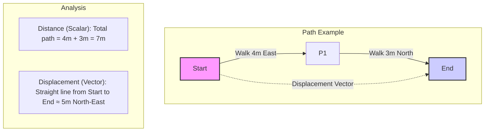
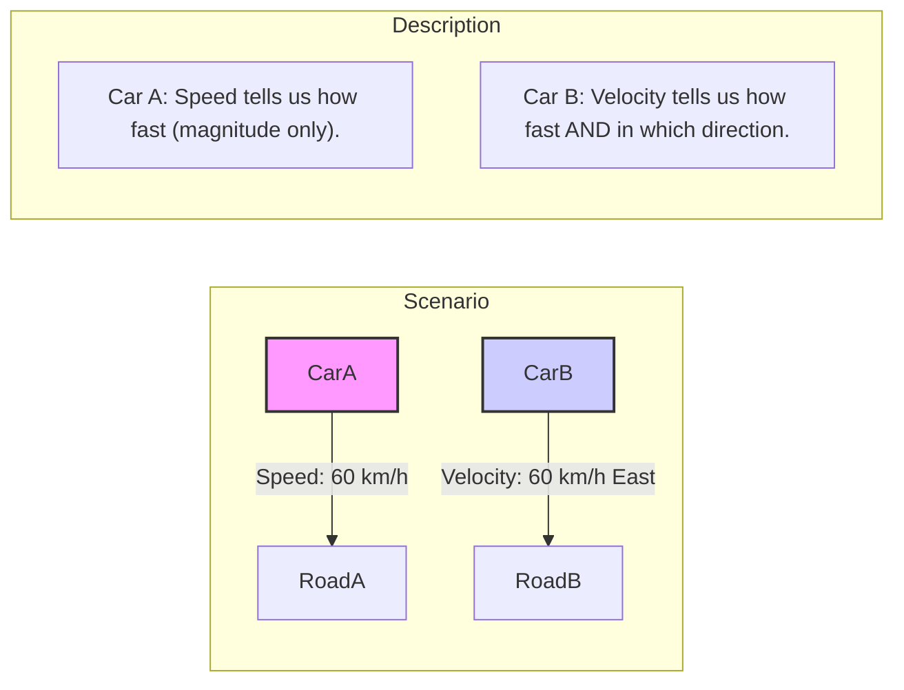

### 1.3 Scalars and Vectors
When describing physical quantities, we often need to specify more than just a number and a unit. Some quantities also require a direction. This leads to the classification of physical quantities into scalars and vectors.

**Scalars:**

A **scalar quantity** is a physical quantity that is fully described by its **magnitude** (a numerical value) and its **unit**. It has no direction associated with it.

*   **Examples of Scalars:**
    *   **Distance:** The total path length covered (e.g., 5 km).
    *   **Speed:** How fast an object is moving (e.g., 60 km/h).
    *   **Mass:** The amount of matter in an object (e.g., 2 kg).
    *   **Time:** Duration (e.g., 30 s).
    *   **Temperature:** Degree of hotness or coldness (e.g., 25 °C or 298 K).
    *   **Energy:** Capacity to do work (e.g., 100 J).
    *   **Work:** Energy transferred by a force (e.g., 50 J).
    *   **Power:** Rate of energy transfer (e.g., 60 W).
    *   **Density:** Mass per unit volume (e.g., 1000 kg/m³).
    *   **Volume:** Space occupied (e.g., 2 m³).
    *   **Electric Charge:** (e.g., 1.6 x 10⁻¹⁹ C).

Scalar quantities can be added, subtracted, multiplied, and divided using ordinary arithmetic rules (provided they have the same units when adding or subtracting).

Consider the difference between **distance** (scalar) and **displacement** (vector):

**Vectors:**

A **vector quantity** is a physical quantity that requires both **magnitude** (with unit) and **direction** to be fully described.

*   **Examples of Vectors:**
    *   **Displacement:** The change in position from a starting point to an ending point, including direction (e.g., 5 km North).
    *   **Velocity:** The rate of change of displacement (speed *and* direction) (e.g., 60 km/h East).
    *   **Acceleration:** The rate of change of velocity (e.g., 9.8 m/s² downwards).
    *   **Force:** A push or a pull (e.g., 10 N upwards).
    *   **Momentum:** Mass times velocity (e.g., 50 kg m/s West).
    *   **Weight:** The force of gravity acting on an object (e.g., 98 N downwards).
    *   **Electric Field:** Force per unit charge (e.g., 200 N/C to the right).
    *   **Magnetic Field:** (e.g., 0.5 T into the page).

Similarly, consider **speed** (scalar) vs. **velocity** (vector):

Vectors are typically represented graphically by arrows. The length of the arrow represents the magnitude (to scale), and the direction the arrow points indicates the direction of the vector.

*(Placeholder for Image: Create an image file (e.g., `01-3_vector_representation.png`) and save it in the `01-Measurements-and-Units/assets/` folder. The image should show an arrow originating from a coordinate system. Label the arrow's length as 'Magnitude (e.g., 5 m)' and indicate its 'Direction' with an angle relative to an axis (e.g., 30° North of East). Add the image here using ``)*

Adding, subtracting, and multiplying vectors requires special methods (vector algebra), which will be covered in more detail in Chapter 2 (Mechanics). This section serves as an introduction to the concept and distinction.

#### Real-World Connections

*   **Navigation:** Giving directions involves vectors (e.g., "walk 500m North, then 200m East"). Displacement is key.
*   **Weather Forecasts:** Wind speed and direction are reported as vectors.
*   **Aviation:** Pilots must account for wind velocity (a vector) when planning flights.
*   **Sports:** Analyzing the trajectory of a ball requires considering its initial velocity (a vector) and the forces (vectors) acting on it.

#### Practice Problems

*(Placeholder: Add 3-4 practice problems requiring identification of quantities as scalar or vector, and interpreting simple vector descriptions.)*

#### Key Takeaways

*   Scalar quantities have magnitude only (e.g., speed, mass, temperature).
*   Vector quantities have both magnitude and direction (e.g., velocity, force, displacement).
*   Vectors are often represented by arrows, where length indicates magnitude and orientation indicates direction.
*   Vector operations (addition, etc.) follow different rules than scalar arithmetic.