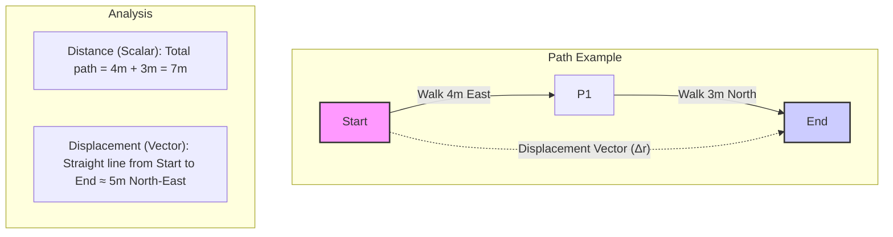

### 2.1 Motion (Kinematics)

Kinematics is the branch of mechanics that describes the motion of objects without considering the forces that cause the motion. We use concepts like position, displacement, velocity, and acceleration to quantify how objects move.

**Position, Distance, and Displacement**

*   **Position (x or r):** An object's location relative to a reference point (origin). It's often represented as a coordinate on an axis or as a position vector **r** in multiple dimensions.
*   **Distance (d):** A scalar quantity representing the total path length covered by an object during its motion.
*   **Displacement (Δx or Δr):** A vector quantity representing the change in an object's position. It's the straight-line distance and direction from the starting point to the ending point.
    *   `Δx = x_final - x_initial` (in one dimension)
    *   `Δ**r** = **r**_final - **r**_initial` (vector form)

Recall the difference from Chapter 1:

**Speed and Velocity**

*   **Average Speed:** The total distance traveled divided by the total time taken. It's a scalar quantity.
    *   `Average Speed = Total Distance / Total Time`
*   **Average Velocity (**v**_avg):** The total displacement divided by the total time taken. It's a vector quantity.
    *   `**v**_avg = Δ**r** / Δt = (**r**_final - **r**_initial) / (t_final - t_initial)`
*   **Instantaneous Speed:** The speed of an object at a specific moment in time (the magnitude of instantaneous velocity).
*   **Instantaneous Velocity (**v**):** The rate of change of position at a specific moment in time. It's the derivative of position with respect to time (`d**r**/dt`). It's a vector quantity (speed + direction).

**Acceleration**

*   **Average Acceleration (**a**_avg):** The change in velocity divided by the time interval over which the change occurs. It's a vector quantity.
    *   `**a**_avg = Δ**v** / Δt = (**v**_final - **v**_initial) / (t_final - t_initial)`
*   **Instantaneous Acceleration (**a**):** The rate of change of velocity at a specific moment in time. It's the derivative of velocity with respect to time (`d**v**/dt`) or the second derivative of position (`d²**r**/dt²`). It's a vector quantity.

*Important Note:* Acceleration occurs if an object's speed *or* direction changes. An object moving at a constant speed in a circle is accelerating because its direction is changing.

**Motion with Constant Acceleration (Uniform Acceleration)**

A common special case is when the acceleration is constant (both magnitude and direction). For motion along a straight line (1D) with constant acceleration `a`, we have the following **equations of motion** (often called SUVAT equations):

1.  `v = u + at` (Velocity-time)
2.  `s = ut + ½at²` (Displacement-time, starting from initial velocity)
3.  `v² = u² + 2as` (Velocity-displacement)
4.  `s = ½(u + v)t` (Displacement-time, using average velocity)

Where:
*   `s` = displacement (sometimes `Δx`)
*   `u` = initial velocity
*   `v` = final velocity
*   `a` = constant acceleration
*   `t` = time interval

*(Placeholder for Image: Create an image file (e.g., `02-1_suvat_summary.png`) in `02-Mechanics/assets/` summarizing the SUVAT equations with labels for each variable. Add using ``)*

**Free Fall:** An object moving only under the influence of gravity (neglecting air resistance) experiences a constant downward acceleration, `g ≈ 9.8 m/s²` near the Earth's surface. The SUVAT equations apply to free fall problems (usually setting `a = -g` if upward is positive).

**Graphical Analysis of Motion**

Graphs are powerful tools for visualizing and analyzing motion:

1.  **Position-Time (x-t or s-t) Graph:**
    *   **Slope:** Represents instantaneous velocity (`v = dx/dt`).
    *   *Straight line:* Constant velocity.
    *   *Curved line:* Changing velocity (acceleration).
    *   *Horizontal line:* Object at rest.

2.  **Velocity-Time (v-t) Graph:**
    *   **Slope:** Represents instantaneous acceleration (`a = dv/dt`).
    *   **Area under the curve:** Represents displacement (`Δx = ∫v dt`).
    *   *Straight line:* Constant acceleration.
    *   *Horizontal line:* Constant velocity (zero acceleration).

3.  **Acceleration-Time (a-t) Graph:**
    *   **Area under the curve:** Represents the change in velocity (`Δv = ∫a dt`).
    *   *Horizontal line:* Constant acceleration.

*(Placeholder for Image: Create an image file (e.g., `02-1_motion_graphs.png`) in `02-Mechanics/assets/` showing example x-t, v-t, and a-t graphs for constant velocity and constant acceleration, highlighting slope and area relationships. Add using ``)*

#### Real-World Connections

*   **Driving:** Understanding speed limits (speed), calculating travel time (velocity, distance), accelerating/decelerating (acceleration).
*   **Sports:** Analyzing the trajectory of a ball (displacement, velocity, acceleration due to gravity), runner's speed and acceleration.
*   **Falling Objects:** Predicting the time it takes for an object to fall (free fall acceleration).

#### Practice Problems

1. **Basic Level:** A car accelerates uniformly from rest to 20 m/s in 8 seconds. Calculate:
   a) The acceleration of the car
   b) The distance traveled during this time
   
   *Solution:*
   a) Using v = u + at:
      u = 0 (starting from rest)
      v = 20 m/s
      t = 8 s
      a = (v - u)/t = (20 - 0)/8 = 2.5 m/s²
   
   b) Using s = ut + ½at²:
      s = 0 × 8 + ½ × 2.5 × 8² = 0 + 80 = 80 m

2. **Intermediate Level:** A stone is thrown vertically upward with an initial velocity of 15 m/s. Calculate:
   a) The maximum height reached
   b) The total time the stone is in the air before returning to the starting point
   (Take g = 9.8 m/s² and neglect air resistance)
   
   *Solution:*
   a) At maximum height, v = 0
      Using v² = u² + 2as:
      0² = 15² + 2 × (-9.8) × s
      s = 15²/(2 × 9.8) = 11.5 m
   
   b) Time to reach maximum height:
      Using v = u + at:
      0 = 15 + (-9.8) × t
      t = 15/9.8 = 1.53 s
      
      Due to symmetry, the total time is twice this value:
      Total time = 2 × 1.53 = 3.06 s

3. **Advanced Level:** A cyclist starts from rest and accelerates at 1.2 m/s² for 10 seconds. The cyclist then maintains a constant speed for 20 seconds before applying brakes, coming to a stop with a uniform deceleration in 8 seconds. Calculate:
   a) The maximum speed reached
   b) The total distance traveled
   c) The average speed for the entire journey
   
   *Solution:*
   a) Maximum speed (after first 10 s):
      v₁ = u + at = 0 + 1.2 × 10 = 12 m/s
   
   b) Distance in first phase (acceleration):
      s₁ = ½at² = ½ × 1.2 × 10² = 60 m
      
      Distance in second phase (constant speed):
      s₂ = v₁ × t = 12 × 20 = 240 m
      
      Distance in third phase (deceleration):
      Final deceleration = v₁/8 = 12/8 = 1.5 m/s²
      s₃ = v₁t - ½at² = 12 × 8 - ½ × 1.5 × 8² = 96 - 48 = 48 m
      
      Total distance = s₁ + s₂ + s₃ = 60 + 240 + 48 = 348 m
   
   c) Total time = 10 + 20 + 8 = 38 s
      Average speed = Total distance/Total time = 348/38 = 9.16 m/s

4. **Intermediate Level:** The position-time graph for an object moving along a straight line is given by a parabola x = 2t² - 3t + 5, where x is in meters and t is in seconds. Find:
   a) The object's position at t = 0 and t = 3 s
   b) The object's velocity at t = 0 and t = 3 s
   c) The object's acceleration
   
   *Solution:*
   a) At t = 0: x = 2(0)² - 3(0) + 5 = 5 m
      At t = 3: x = 2(3)² - 3(3) + 5 = 2(9) - 9 + 5 = 18 - 9 + 5 = 14 m
   
   b) Velocity is the derivative of position: v = dx/dt = 4t - 3
      At t = 0: v = 4(0) - 3 = -3 m/s (negative means moving in negative x direction)
      At t = 3: v = 4(3) - 3 = 12 - 3 = 9 m/s
   
   c) Acceleration is the derivative of velocity: a = dv/dt = 4 m/s²
      The acceleration is constant.

5. **Advanced Level:** A ball is thrown horizontally from the top of a building 45 m high with an initial velocity of 15 m/s. Calculate:
   a) The time taken for the ball to reach the ground
   b) The horizontal distance traveled before hitting the ground
   c) The velocity (magnitude and direction) with which the ball hits the ground
   (Take g = 9.8 m/s² and neglect air resistance)
   
   *Solution:*
   a) Vertical motion (starting from rest in vertical direction):
      Using s = ut + ½gt²:
      45 = 0 + ½ × 9.8 × t²
      t² = 45 × 2/9.8 = 9.18
      t = 3.03 s
   
   b) Horizontal distance:
      x = u × t = 15 × 3.03 = 45.45 m
   
   c) Final vertical velocity:
      v_y = u + gt = 0 + 9.8 × 3.03 = 29.7 m/s (downward)
      
      Horizontal velocity remains constant:
      v_x = 15 m/s
      
      Resultant velocity magnitude:
      v = √(v_x² + v_y²) = √(15² + 29.7²) = √(225 + 882.1) = √1107.1 = 33.3 m/s
      
      Direction (angle below horizontal):
      θ = tan⁻¹(v_y/v_x) = tan⁻¹(29.7/15) = 63.2°

#### Key Takeaways

*   Kinematics describes motion using position, displacement, distance, speed, velocity, and acceleration.
*   Distinguish between scalar (distance, speed) and vector (displacement, velocity, acceleration) quantities.
*   Average quantities are calculated over a time interval; instantaneous quantities are at a specific moment.
*   Constant acceleration allows the use of specific equations of motion (SUVAT).
*   Motion graphs (x-t, v-t, a-t) provide visual representations of motion; slopes and areas under curves yield important kinematic quantities.

#### Common Misconceptions

*   **Misconception:** Acceleration always means an object is speeding up.
   **Correction:** Acceleration refers to any change in velocity, which includes speeding up, slowing down, or changing direction. An object slowing down has a negative acceleration (deceleration) in the direction of motion. An object moving in a circle at constant speed is accelerating because its direction is changing.

*   **Misconception:** Zero velocity means zero acceleration.
   **Correction:** Velocity and acceleration are independent quantities. An object can have zero velocity at an instant (like a ball at the top of its flight) but still have non-zero acceleration (due to gravity). Similarly, an object can have zero acceleration (moving at constant velocity) while having a non-zero velocity.

*   **Misconception:** Distance and displacement are the same thing.
   **Correction:** Distance is a scalar quantity representing the total path length traveled, while displacement is a vector representing the straight-line distance and direction from start to finish. If you walk around a 400m track and return to the start, your distance is 400m but your displacement is 0m.

*   **Misconception:** The SUVAT equations apply to all types of motion.
   **Correction:** The SUVAT equations only apply to motion with constant acceleration. They cannot be used directly for varying acceleration (like a car in real traffic) or circular motion. For these cases, calculus or other approaches are needed.

#### Try It Yourself

**Analyzing Motion with a Smartphone**

**Materials needed:**
- Smartphone with a physics motion sensor app (like "Physics Toolbox Sensor Suite," "Phyphox," or similar)
- A safe, open space for movement
- A friend to help (optional)

**Procedure:**
1. Install a physics motion sensor app on your smartphone
2. Set up the app to record acceleration data
3. Perform and record several different types of motion:
   a. Hold the phone still for a few seconds
   b. Walk at a constant speed in a straight line
   c. Accelerate from rest to a brisk walk, then maintain speed
   d. Walk at constant speed, then stop abruptly
   e. Move the phone in a vertical circle at approximately constant speed
4. Export or screenshot the acceleration vs. time graphs
5. Analyze the patterns in the data for each type of motion

**Questions to Consider:**
- What does the acceleration graph look like when you're moving at constant velocity?
- How does the acceleration graph change when you start or stop moving?
- Can you identify the direction of acceleration from the data?
- What do you notice about acceleration when moving in a circle?
- How do these real-world measurements compare to the idealized models discussed in class?

#### Historical Note

The study of motion has ancient roots, but the modern mathematical approach to kinematics began with Galileo Galilei (1564-1642). Before Galileo, Aristotelian physics dominated, claiming that heavier objects fall faster than lighter ones and that objects need a continuous force to maintain motion.

Galileo challenged these ideas through careful experiments and mathematical reasoning. He discovered that, neglecting air resistance, all objects fall at the same rate regardless of mass. Using inclined planes to slow down motion and water clocks to measure time, he deduced that freely falling objects have constant acceleration. He also formulated an early version of the principle of inertia, noting that objects in motion tend to stay in motion.

Isaac Newton (1642-1727) later formalized these insights in his laws of motion, providing the mathematical framework for kinematics and dynamics. Newton's development of calculus was partly motivated by the need to describe motion mathematically, particularly when acceleration varies.

The SUVAT equations, though not explicitly written by Newton, are derived from his second law and the calculus of motion. They represent the special case of constant acceleration that is commonly taught first because of its mathematical simplicity and wide applicability.

Today, kinematics has applications far beyond traditional mechanics, from analyzing athletic performance to programming the movement of robots and understanding the expansion of the universe. The fundamental concepts of position, velocity, and acceleration remain central to our understanding of how things move.