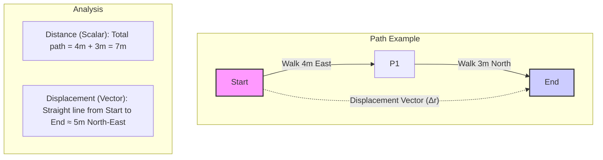

### 2.1 Motion (Kinematics)

Kinematics is the branch of mechanics that describes the motion of objects without considering the forces that cause the motion. We use concepts like position, displacement, velocity, and acceleration to quantify how objects move.

**Position, Distance, and Displacement**

*   **Position (x or r):** An object's location relative to a reference point (origin). It's often represented as a coordinate on an axis or as a position vector **r** in multiple dimensions.
*   **Distance (d):** A scalar quantity representing the total path length covered by an object during its motion.
*   **Displacement (Δx or Δr):** A vector quantity representing the change in an object's position. It's the straight-line distance and direction from the starting point to the ending point.
    *   `Δx = x_final - x_initial` (in one dimension)
    *   `Δ**r** = **r**_final - **r**_initial` (vector form)

Recall the difference from Chapter 1:

**Speed and Velocity**

*   **Average Speed:** The total distance traveled divided by the total time taken. It's a scalar quantity.
    *   `Average Speed = Total Distance / Total Time`
*   **Average Velocity (**v**_avg):** The total displacement divided by the total time taken. It's a vector quantity.
    *   `**v**_avg = Δ**r** / Δt = (**r**_final - **r**_initial) / (t_final - t_initial)`
*   **Instantaneous Speed:** The speed of an object at a specific moment in time (the magnitude of instantaneous velocity).
*   **Instantaneous Velocity (**v**):** The rate of change of position at a specific moment in time. It's the derivative of position with respect to time (`d**r**/dt`). It's a vector quantity (speed + direction).

**Acceleration**

*   **Average Acceleration (**a**_avg):** The change in velocity divided by the time interval over which the change occurs. It's a vector quantity.
    *   `**a**_avg = Δ**v** / Δt = (**v**_final - **v**_initial) / (t_final - t_initial)`
*   **Instantaneous Acceleration (**a**):** The rate of change of velocity at a specific moment in time. It's the derivative of velocity with respect to time (`d**v**/dt`) or the second derivative of position (`d²**r**/dt²`). It's a vector quantity.

*Important Note:* Acceleration occurs if an object's speed *or* direction changes. An object moving at a constant speed in a circle is accelerating because its direction is changing.

**Motion with Constant Acceleration (Uniform Acceleration)**

A common special case is when the acceleration is constant (both magnitude and direction). For motion along a straight line (1D) with constant acceleration `a`, we have the following **equations of motion** (often called SUVAT equations):

1.  `v = u + at` (Velocity-time)
2.  `s = ut + ½at²` (Displacement-time, starting from initial velocity)
3.  `v² = u² + 2as` (Velocity-displacement)
4.  `s = ½(u + v)t` (Displacement-time, using average velocity)

Where:
*   `s` = displacement (sometimes `Δx`)
*   `u` = initial velocity
*   `v` = final velocity
*   `a` = constant acceleration
*   `t` = time interval

*(Placeholder for Image: Create an image file (e.g., `02-1_suvat_summary.png`) in `02-Mechanics/assets/` summarizing the SUVAT equations with labels for each variable. Add using ``)*

**Free Fall:** An object moving only under the influence of gravity (neglecting air resistance) experiences a constant downward acceleration, `g ≈ 9.8 m/s²` near the Earth's surface. The SUVAT equations apply to free fall problems (usually setting `a = -g` if upward is positive).

**Graphical Analysis of Motion**

Graphs are powerful tools for visualizing and analyzing motion:

1.  **Position-Time (x-t or s-t) Graph:**
    *   **Slope:** Represents instantaneous velocity (`v = dx/dt`).
    *   *Straight line:* Constant velocity.
    *   *Curved line:* Changing velocity (acceleration).
    *   *Horizontal line:* Object at rest.

2.  **Velocity-Time (v-t) Graph:**
    *   **Slope:** Represents instantaneous acceleration (`a = dv/dt`).
    *   **Area under the curve:** Represents displacement (`Δx = ∫v dt`).
    *   *Straight line:* Constant acceleration.
    *   *Horizontal line:* Constant velocity (zero acceleration).

3.  **Acceleration-Time (a-t) Graph:**
    *   **Area under the curve:** Represents the change in velocity (`Δv = ∫a dt`).
    *   *Horizontal line:* Constant acceleration.

*(Placeholder for Image: Create an image file (e.g., `02-1_motion_graphs.png`) in `02-Mechanics/assets/` showing example x-t, v-t, and a-t graphs for constant velocity and constant acceleration, highlighting slope and area relationships. Add using ``)*

#### Real-World Connections

*   **Driving:** Understanding speed limits (speed), calculating travel time (velocity, distance), accelerating/decelerating (acceleration).
*   **Sports:** Analyzing the trajectory of a ball (displacement, velocity, acceleration due to gravity), runner's speed and acceleration.
*   **Falling Objects:** Predicting the time it takes for an object to fall (free fall acceleration).

#### Practice Problems

*(Placeholder: Add 4-6 practice problems involving calculations using definitions, SUVAT equations, and interpretation of motion graphs.)*

#### Key Takeaways

*   Kinematics describes motion using position, displacement, distance, speed, velocity, and acceleration.
*   Distinguish between scalar (distance, speed) and vector (displacement, velocity, acceleration) quantities.
*   Average quantities are calculated over a time interval; instantaneous quantities are at a specific moment.
*   Constant acceleration allows the use of specific equations of motion (SUVAT).
*   Motion graphs (x-t, v-t, a-t) provide visual representations of motion; slopes and areas under curves yield important kinematic quantities.