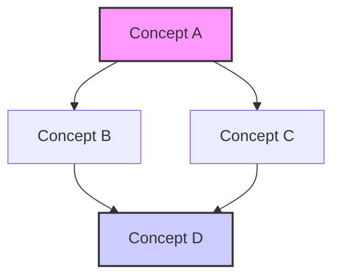

### [Section Number] [Section Title]

[Brief introduction to the topic - 2-3 sentences explaining what this section covers and why it's important]

**[Key Concept 1]**

[Clear explanation of the first key concept. Include definitions, principles, and fundamental ideas.]

*   **[Subconcept 1]:** [Explanation with relevant details]
*   **[Subconcept 2]:** [Explanation with relevant details]

[Additional paragraphs as needed to fully explain the concept]

[Mathematical formulation if applicable:]
*   `[Equation]` (where `[variable]` = [meaning])

**[Key Concept 2]**

[Clear explanation of the second key concept]

[Include a visual representation where appropriate:]

*(Placeholder for Image: Create an image file (e.g., `[chapter]-[section]_[description].png`) in `[chapter]/assets/` showing [description of what the image should contain]. Add using ``)*

#### Real-World Connections

*   **[Application Area 1]:** [Explanation of how this concept applies in the real world]
*   **[Application Area 2]:** [Explanation of how this concept applies in the real world]
*   **[Application Area 3]:** [Explanation of how this concept applies in the real world]

#### Practice Problems

1. **Basic Level:** [Problem statement]
   *Hint: [Optional hint]*
   *Solution: [Step-by-step solution]*

2. **Intermediate Level:** [Problem statement]
   *Hint: [Optional hint]*
   *Solution: [Step-by-step solution]*

3. **Advanced Level:** [Problem statement]
   *Hint: [Optional hint]*
   *Solution: [Step-by-step solution]*

#### Common Misconceptions

*   **Misconception:** [Common incorrect understanding]
   **Correction:** [Explanation of the correct understanding]

*   **Misconception:** [Common incorrect understanding]
   **Correction:** [Explanation of the correct understanding]

#### Try It Yourself

[Simple activity that students can perform with minimal equipment to explore the concept]

**Materials needed:**
- [Item 1]
- [Item 2]

**Procedure:**
1. [Step 1]
2. [Step 2]
3. [Step 3]

**Questions to Consider:**
- [Question 1]
- [Question 2]

#### Key Takeaways

*   [Concise summary of the first main point]
*   [Concise summary of the second main point]
*   [Concise summary of the third main point]
*   [Concise summary of the fourth main point]

#### Historical Note

[Brief historical context about the development of this concept or the scientists involved]