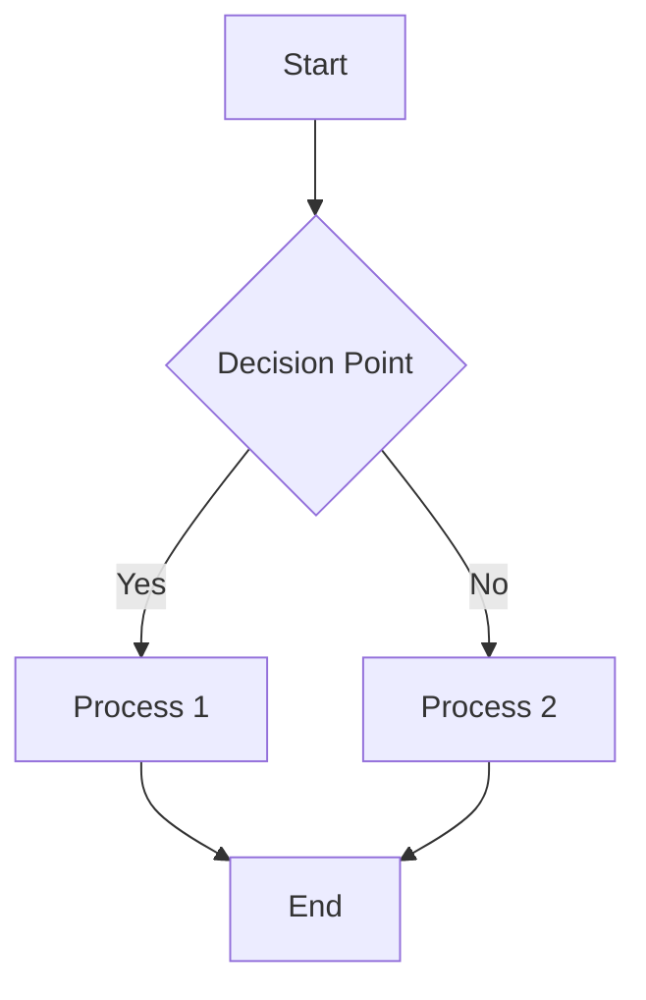

# Visual Aids Development Guide

This guide provides detailed standards and best practices for creating visual aids across all chapters of the physics textbook, expanding on the guidelines in the Content Development Guide.

## Types of Visual Aids

### 1. Diagrams
- **Conceptual Diagrams:** Illustrate abstract concepts or relationships
- **Process Diagrams:** Show step-by-step processes or transformations
- **Structural Diagrams:** Depict the structure of objects or systems
- **Free Body Diagrams:** Show forces acting on objects (especially for mechanics)
- **Circuit Diagrams:** Represent electrical circuits with standard symbols
- **Ray Diagrams:** Illustrate light paths in optical systems

### 2. Graphs
- **Line Graphs:** Show relationships between continuous variables
- **Bar Graphs:** Compare discrete categories
- **Scatter Plots:** Display correlation between variables
- **Pie Charts:** Show proportions of a whole
- **3D Graphs:** Represent relationships between three variables

### 3. Charts and Tables
- **Comparison Charts:** Highlight similarities and differences
- **Flow Charts:** Illustrate decision processes or algorithms
- **Data Tables:** Present organized numerical information
- **Periodic Tables:** Show patterns in element properties (for atomic physics)

### 4. Illustrations
- **Apparatus Setups:** Show experimental arrangements
- **Cross-Sections:** Reveal internal structures
- **Cutaway Views:** Display internal components while maintaining context
- **Exploded Views:** Show assembly relationships between components

### 5. Photographs
- **Real Equipment:** Show actual laboratory apparatus
- **Phenomena:** Capture physical phenomena in action
- **Historical Photos:** Show scientists or historical experiments

## Visual Aid Development Standards

### 1. Technical Accuracy
- All visual elements must be scientifically accurate
- Scale should be preserved where relevant (or clearly noted if not to scale)
- Vector arrows should have appropriate relative lengths and directions
- Graphs must have properly labeled axes with units

### 2. Clarity and Simplicity
- Focus on the essential elements; avoid visual clutter
- Use consistent visual language throughout the textbook
- Ensure text is legible (minimum 10pt font when rendered)
- Use high contrast for important elements

### 3. Accessibility
- Provide comprehensive alt text for all images
- Use color combinations that are distinguishable by colorblind readers
- Don't rely solely on color to convey information
- Ensure sufficient contrast between text and background

### 4. Consistency
- Use consistent symbols across all diagrams
- Maintain consistent style and color schemes
- Use standard scientific conventions where they exist
- Follow the naming convention: `[chapter]-[section]_[brief_description].[format]`

## Implementation Guidelines by Visual Aid Type

### Mermaid Diagrams

For diagrams that can be created using Mermaid syntax:

- **Best for:** Flow charts, simple relationship diagrams, state diagrams
- **Implementation:** Embed directly in Markdown using code fences with `mermaid` language identifier
- **Styling:** Use the `style` keyword to customize node appearance
- **Syntax Tips:** 
  - Always use quotes around text containing spaces or special characters
  - For complex diagrams, build incrementally and test rendering
  - Keep node IDs short but descriptive

### External Images

For more complex visuals that cannot be created with Mermaid:

- **File Format Selection:**
  - **PNG:** Use for diagrams, illustrations with sharp lines, screenshots
  - **JPG:** Use for photographs or images with complex color gradients
  - **SVG:** Preferred for diagrams when possible (scalable, smaller file size)

- **Creation Tools:**
  - **diagrams.net (draw.io):** Free web-based tool for various diagrams
  - **Inkscape:** Free vector graphics editor for detailed illustrations
  - **GeoGebra:** Excellent for mathematical functions and geometry
  - **Matplotlib/Python:** For generating precise scientific graphs
  - **GIMP/Photoshop:** For editing photographs or complex raster graphics

- **Storage and Reference:**
  - Save in the appropriate `assets` folder within the chapter directory
  - Reference using Markdown image syntax with descriptive alt text
  - Example: ``

## Chapter-Specific Visual Aid Requirements

### Chapter 1: Measurements and Units
- Diagram showing SI base and derived units relationships
- Visual scale comparing different orders of magnitude
- Diagrams illustrating vector vs. scalar quantities
- Accuracy vs. precision target diagrams

### Chapter 2: Mechanics
- Motion graphs (position-time, velocity-time, acceleration-time)
- Free body diagrams for various force scenarios
- Energy transformation diagrams
- Momentum and collision illustrations
- Circular motion and centripetal force diagrams
- Simple harmonic motion graphs and phase diagrams
- Simple machines diagrams showing mechanical advantage

### Chapter 3: Thermal Physics
- Temperature scales comparison
- Heat transfer mechanism illustrations
- PV diagrams for thermodynamic processes
- Phase change diagrams
- Molecular motion visualizations

### Chapter 4: Waves and Optics
- Wave parameter illustrations (amplitude, wavelength, frequency)
- Standing wave diagrams
- Wave interference patterns
- Ray diagrams for reflection and refraction
- Lens and mirror diagrams
- Electromagnetic spectrum visualization

### Chapter 5: Electricity and Magnetism
- Electric field line diagrams
- Circuit diagrams with standard symbols
- Magnetic field visualizations
- Electromagnetic induction illustrations
- Capacitor and inductor diagrams

### Chapter 6: Atomic and Nuclear Physics
- Atomic model illustrations
- Energy level diagrams
- Nuclear decay process visualizations
- Particle interaction diagrams
- Radiation penetration illustrations

### Chapter 7 & 8: Optional Topics
- Electronic component diagrams
- Logic gate symbols and truth tables
- Solar system and celestial object illustrations
- Star life cycle diagrams
- Galaxy structure visualizations

### Chapter 9: Practical Skills
- Laboratory equipment diagrams
- Experimental setup illustrations
- Data collection and analysis flowcharts
- Error analysis visualizations

## Quality Checklist for Visual Aids

Before finalizing any visual aid, ensure it meets these criteria:

- [ ] Scientifically accurate and up-to-date
- [ ] Clearly illustrates the intended concept
- [ ] Properly labeled with all necessary components
- [ ] Follows consistent style guidelines
- [ ] Accessible (alt text, color choices, etc.)
- [ ] Appropriate complexity for the educational level
- [ ] Properly referenced in the text
- [ ] Stored in the correct location with proper naming
- [ ] Optimized for digital display (appropriate resolution and file size)
- [ ] Free of copyright issues (original or properly licensed)